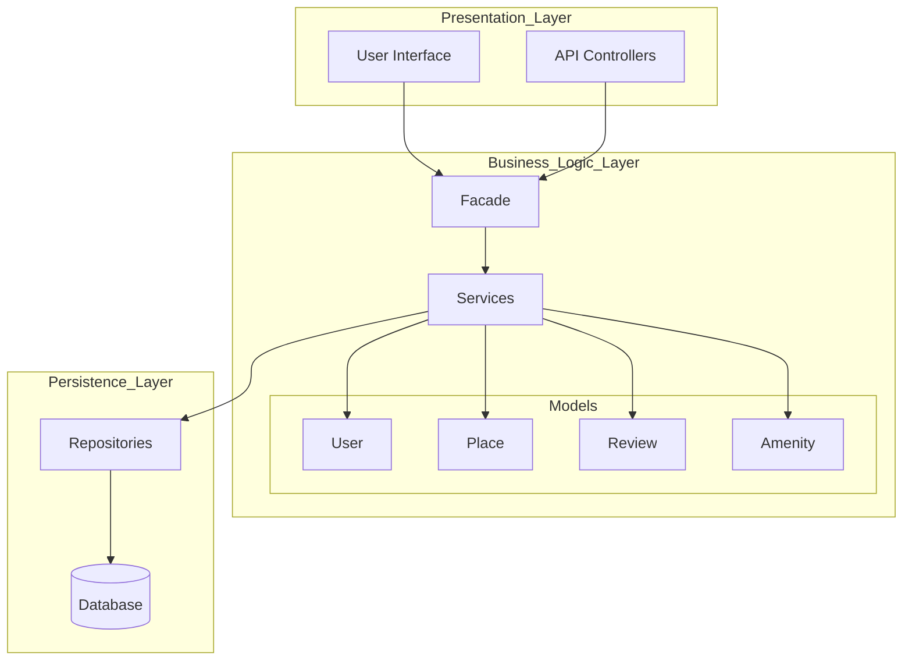
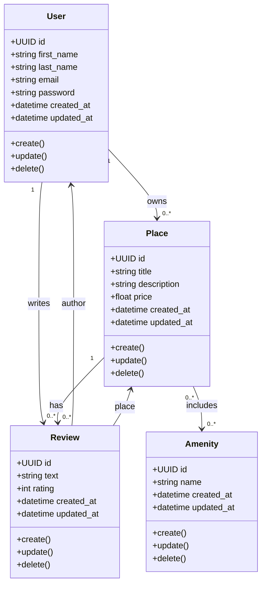
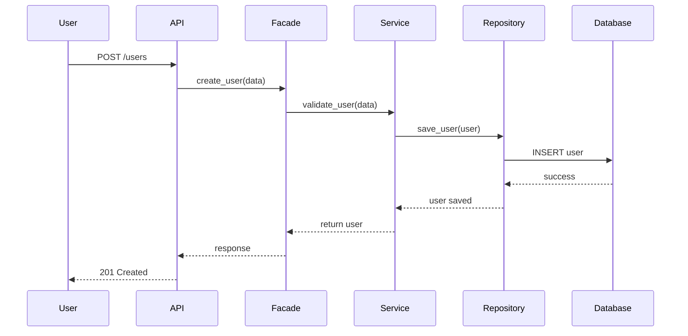
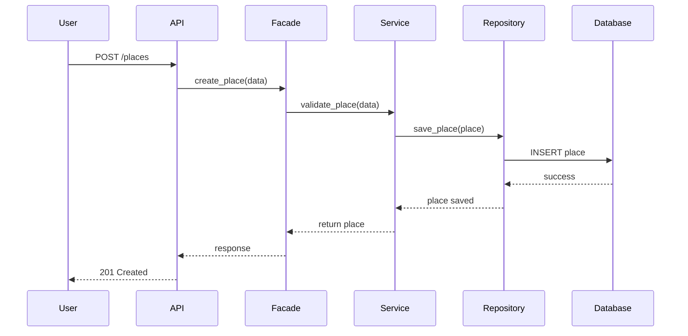
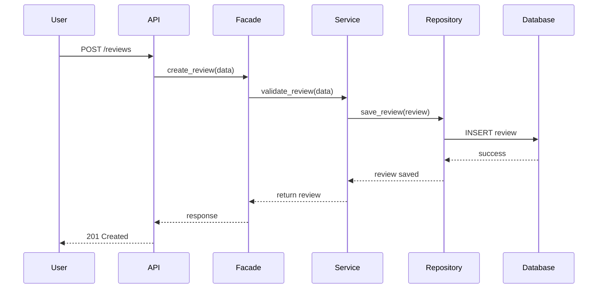
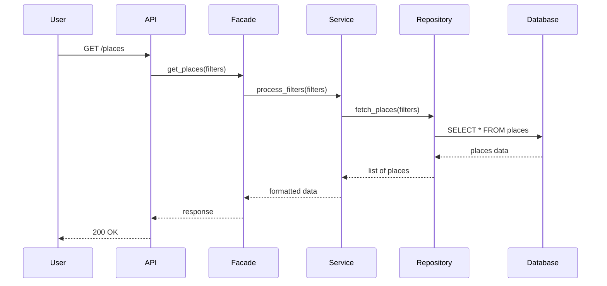

# HBnB Technical Documentation

## 1. Introduction

This document provides a comprehensive technical overview of the HBnB application architecture and design. It serves as a blueprint for the development process by illustrating the system structure, core business logic, and interaction flows.

The document includes:
- High-Level Architecture (Package Diagram)
- Business Logic Layer (Class Diagram)
- API Interaction Flow (Sequence Diagrams)

The goal is to ensure clarity, maintainability, and scalability of the system.

---

## 2. High-Level Architecture

### Package Diagram

### Explanation

The system follows a **three-layer architecture**:

- **Presentation Layer**
  - Handles user interaction via UI and API
  - Sends requests to the system

- **Business Logic Layer**
  - Contains core application logic
  - Includes services, models, and a facade

- **Persistence Layer**
  - Manages database operations
  - Uses repositories for data access

### Facade Pattern

The **Facade** acts as a single entry point to the Business Logic Layer.  
It simplifies communication and reduces coupling between layers.

---

## 3. Business Logic Layer

### Class Diagram

### Explanation

#### Entities

- **User**: Represents application users
- **Place**: Represents property listings
- **Review**: Represents feedback on places
- **Amenity**: Represents features (e.g., Wi-Fi, parking)

#### Design Decisions

- Each entity includes:
  - Unique identifier (UUID)
  - Creation and update timestamps
- CRUD methods are defined for basic operations

#### Relationships

- A User can own multiple Places
- A User can write multiple Reviews
- A Place can have multiple Reviews
- A Place can have multiple Amenities (many-to-many)
- A Review is linked to both User and Place

---

## 4. API Interaction Flow

### 4.1 User Registration

---

### 4.2 Place Creation

---

### 4.3 Review Submission

---

### 4.4 Fetch List of Places

---

### Explanation

All API calls follow a consistent interaction flow:

User → API → Facade → Service → Repository → Database → Response

#### Key Points

- **API Layer** handles incoming requests
- **Facade** simplifies access to business logic
- **Service Layer** processes logic and validation
- **Repository Layer** handles database operations
- **Database** stores persistent data

---

## 5. Conclusion

This document provides a structured overview of the HBnB system architecture and design.

It ensures:
- Clear separation of concerns
- Scalable and maintainable architecture
- Consistent interaction patterns across the system

The diagrams and explanations serve as a reliable reference for development and future enhancements.
